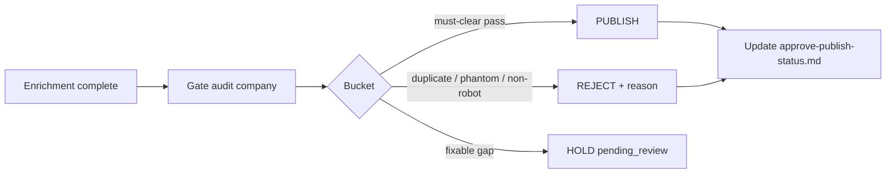

# Approve / Reject Robots Playbook

Third lane after **Discovery** and **Enrichment**. Company-scoped, gate-driven, never silent-auto.

## Product rule — Approve = Publish

For robots, **Approve** and **Publish** are the same outcome: ready for public view.

- Content-queue **Approve** sets `status=published` and `published_at` (see `api_approve_robot`).
- Do **not** treat `approved` as a separate human step for robots.
- Living checklist language may still say “approve/publish” — it means one public-ready action.

## When to use

| Signal | Use this playbook |
|--------|-------------------|
| Enrichment must-clear done for a company (or clean subset) | Yes |
| User says “approve tonight”, “moderate company N”, “reject duplicates” | Yes |
| Still missing photo / country / categories / uses / features | No — send back to Enrich |

## Pipeline



## Gates

**Must-clear (block publish):**

- Valid photo (owned CDN HTTP 200 + image body when already copied)
- Features ≥ 40 chars
- Manufacturer country
- Categories and uses

**Soft OK (do not block):**

- Missing video / typed specs / tags / price / release year
- `few_photos` when OEM honestly has only 1–3 angles

## Buckets

| Bucket | Criteria | Action |
|--------|----------|--------|
| **publish** | All must-clear pass | Content-queue Approve → `published` |
| **reject** | Duplicate, phantom SKU, non-robot, deliberate no-path IMAGE TO-DO | `rejected` + coded `rejection_reason` |
| **hold** | Fixable gate fail or needs merge decision | Leave `pending_review`; note blocker |

### Reject reason codes

Use one code as the start of `rejection_reason`:

- `duplicate` — same SKU as another row (prefer keep Standard over bare family name)
- `phantom_sku` — not on live OEM catalog
- `non_robot` — accessory / software / joint module / kit
- `no_hero_deliberate` — IMAGE TO-DO with no OEM path
- `wrong_oem` — belongs to another manufacturer
- `reseller_shell` — white-label / third-party listing only

## Session steps

1. Pick `company_id` from [approve-publish-status.md](../checklists/approve-publish-status.md) or triage.
2. Dry-run:

```bash
cd scripts/research
python -u moderate_robots.py --company-id N
```

3. Spot-check **3–5** heroes (download + visual QA) from the publish bucket.
4. User confirms proceed.
5. Apply publish/reject (admin bulk Approve with dry-run IDs, or script `--apply` when wired):

```bash
python -u moderate_robots.py --company-id N --apply --ids 3214 3215 ...
python -u moderate_robots.py --company-id N --apply --reject-ids 5227 --reason "duplicate: keep RM65 Standard"
```

6. Update [approve-publish-status.md](../checklists/approve-publish-status.md) Status / Pending / Cleared.
7. Append [log.md](../log.md).

## Anti-patterns

- Never auto-publish from Enrichment “done”.
- Never bulk-publish a **Partial** company without an ID allowlist.
- Never reject without a reason code.
- Never invent missing variants during moderation — that is Discovery/Enrich.

## Related

- [checklists/approve-publish-status.md](../checklists/approve-publish-status.md)
- Skill: [../../../.cursor/skills/robot-moderation-queue/SKILL.md](../../../.cursor/skills/robot-moderation-queue/SKILL.md)
- Status machine: [../../../.cursor/skills/content-moderation-queue/SKILL.md](../../../.cursor/skills/content-moderation-queue/SKILL.md)
- Enrich gates: [../../../.cursor/skills/content-queue-robot-backfill/SKILL.md](../../../.cursor/skills/content-queue-robot-backfill/SKILL.md)
- Script: `scripts/research/moderate_robots.py`
- [index.md](../index.md)
- [log.md](../log.md)
