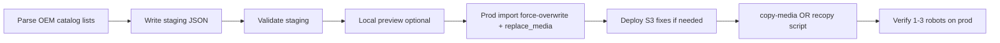

# Catalog OEM Import Playbook

Use when a manufacturer publishes **server-rendered product list pages** with per-model hero images and detail URLs — not when you need full crawl/enrich (`auto pipeline`).

**Reference case:** Estun Robotics (company id 220, slug `estun-robotics`).

## When to use this playbook

| Signal | Use catalog playbook | Use `auto pipeline` instead |
|--------|----------------------|-----------------------------|
| Product list HTML with model names + images | Yes | No |
| Opaque URLs but searchable catalog pages | Yes (parse lists, fuzzy match names) | Maybe search fallback only |
| SPA-only site, no list HTML | No | Yes |
| Need specs from datasheets only on detail pages | Hybrid: catalog for URL/image, enrich for specs | Yes |

## Pipeline overview



## Step 1 — Discover catalog structure

- Find **English** (or target locale) list URLs first — often cleaner than Chinese root site.
- Estun example: `en.estun.com/?list_13/`, `list_161`, `list_191`, `list_162`.
- Record list URL → category mapping in a manufacturer-specific parser module (see `estun_english_catalog.py`).

## Step 2 — Build or reuse catalog script

Pattern for a new OEM:

1. `parse_{oem}_catalog.py` — fetch list pages, extract `(name, url, image)`.
2. `apply_{oem}_catalog.py` — merge into staging JSON, optional `--apply-import`.
3. Fuzzy name matching when staging names differ from catalog (`iER` vs `ER`, numeric fingerprints).

**Do not** run `auto robots --all-robots --refresh-media` on catalog OEMs — it re-scrapes footers and overwrites good heroes.

## Step 3 — Staging quality gates

Before any import, spot-check **3 robots**:

- `url` = per-model page (not `/solute/`, `tel:`, homepage).
- `image` = product hero under `/upload/image/` or equivalent — not `f-phone.png`, social icons.
- `sources[0].url` matches `url`.
- Run: `python cli.py validate --dir staging/robots/{slug}/`.

## Step 4 — Local preview (recommended)

```powershell
cd scripts/research
python apply_{oem}_catalog.py --local --apply-import --force-overwrite --created-by-id 1
```

- `--local` targets `127.0.0.1:8000` via `IMPORT_SYNC_API_BASE_URL_LOCAL`.
- Confirm one robot in content queue: correct URL + robot photo (not phone icon).
- OEM hotlink CDNs may 502 in browser — local server-side copy to `/media/` avoids that.

## Step 5 — Prod import (once)

```powershell
python apply_{oem}_catalog.py --apply-import --force-overwrite --created-by-id 1 --batch-size 5
```

| Flag | Why |
|------|-----|
| `--force-overwrite` | Patch import skips non-empty prod `url`/`image` |
| `replace_media=True` (in script) | Replaces photos; does not merge with junk gallery |
| `--batch-size 5` | Reduces gateway timeout risk |

**Stop** any in-flight `auto robots` / enrich shell for this company before importing.

## Step 6 — S3 / CDN images

**Prerequisites (server deploy):**

- Sync recopy via `replace_media` in bulk import.
- Versioned S3 keys (`-v{timestamp}`) so CDN does not serve stale bad bytes.
- Never re-download from `cdn.robotaigeek.com` when fixing bad heroes.
- OEM-specific CDN allowlists if redirects block copy (Estun → `*-estun-*.img.addlink.cn`).

**After deploy, choose one path:**

| Method | When | Command |
|--------|------|---------|
| **copy-media** (preferred on prod) | Bulk import 502s from sync copy timeout | `python trigger_estun_copy_media.py` (adapt for OEM) |
| **recopy script** | Smaller batches OK; full staging rows | `python recopy_estun_images.py --apply --batch-size 5` |

Verify via API for one robot:

- `url` = OEM product page
- `s3_image` = versioned CDN path
- Image size ~20–100 KB (not tiny icon)

## Step 7 — Sign-off and state

- User reviews ≥1 robot on prod content queue.
- Document unmatched models (catalog gaps) — do not Apify-search all robots for a few misses.
- `python cli.py state mark --type company --id {id}` only after sign-off.

## Scripts map (Estun template)

| Script | Role |
|--------|------|
| `estun_english_catalog.py` | Parse English list pages |
| `apply_estun_english_catalog.py` | Apply to staging + import |
| `recopy_estun_images.py` | Force S3 recopy from staging heroes |
| `trigger_estun_copy_media.py` | Prod copy-media via internal API |

## Related

- [../checklists/prod-manufacturer-import.md](../checklists/prod-manufacturer-import.md)
- [../reference/estun-import-postmortem.md](../reference/estun-import-postmortem.md)
- [../concepts/catalog-vs-enrich-pipeline.md](../concepts/catalog-vs-enrich-pipeline.md)
- [../index.md](../index.md)
